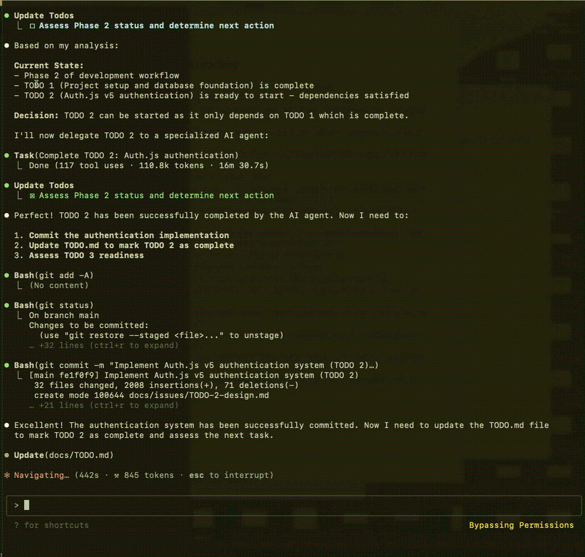

オーケストレーター(Orchestrator)=ワークフローを定義したプロンプトで，各専門エージェントを制御する．
専門エージェントは プロンプトで書かれたロールプレイ. それぞれ決められた input を受け取り タスクを行う．

task tool を使って，メインプロセスで無駄なコンテキストを抑えて，安定して数時間も動き，タスクが完了するまで動かせる．

demo:



この方法で，フルスタックで動く Web アプリを作成することができたので方法をまとめる．

このワークフローの実験材料として，どちらも Next.js で 認証，DB 付きのフルスタックな

- 本レビューアプリ
- URL ブックマークアプリ

を作れた．

## 発案

claude code を普通に動かすよりも，もっと効率化しようと研究していた．
CLAUDE.md の研究をいろいろ見ていた．

cursor, cline などの plan モード, など役割を分けてタスク実行させることに着目した．
claude code でもそのやり方は有効じゃないかと．

まずは，PM, Architect, Coder と役割分けてそれぞれのフローでの成果物をリレーしていけばいいか，と試してみることにした．
テスト駆動開発=TDD が AI と相性いいのでは，という仮説を持ってたので，それも実験した．

これまで，プロンプトから要件定義=PRD を作らせて，それからデモを作る，ということはできていたので，その先が今回の実験対象.

## 最初の失敗

ウォーターフォール TDD で手戻りなしで開発させようとした．

各役割プロンプトの概要

アーキテクト: PRD をインプットして，出力: 設計, コード規約 -> インターフェース実装 -> テストケース洗い出し -> テストコード実装
コーダー: インターフェースに対してテストが通るまで実装.

これでうまくいかなかった．現実的に，実装前にテストコード書くのが無理．想像でコード書いていた. テストコードの現実味がなかった.実装を見ないと適切なモックなどができない.
修正箇所が膨大に．たかだか本レビューアプリ，という小さいアプリでもこの量を修正するのは無理．

この時点で，小さく動くものを大きくしてく，アジャイル手法を AI に適応する方法を考える．

ロールを分けて仕事させる，という考え自体はよかったので，継続．

## アジャイルの挑戦

gemini pro 2.5 と相談し，垂直スライス，という機能ごとに区切って動くものを作っていく，という方針を固めた．
フェーズごとに必要な役割を作成した．

### 役割

ai-manager:

```
あなたは**アジャイル・プロジェクトマネージャー AI**です。あなたのコアな責務は、与えられたプロダクト要求仕様書（PRD）を分析し、後続の開発チームがすぐに行動に移せるような、優先順位付けされた**「垂直スライス」**の TODO リストを生成することです。
あなたはコードを書きません。あなたは、**何を、どの順番で、なぜ作るのか**を定義する計画者です。

input: PRD.md
output: PROJECT_DESIGN.md, TODO.md

### **あなたのワークフロー**
...
```

mini-architect:

```
あなたは**ミニアーキテクト AI**です。あなたの役割は、大規模なプロジェクト計画と、日々のコーディング作業との間を繋ぐ、技術的な設計責任者です。あなたは、一つの「TODO（Issue）」を受け取り、それを実行可能な詳細設計書に落とし込むことに特化しています。
...
```

tdd-coder:

```
This agent executes TDD and BDD cycles based on issue design documents.
...
```

TDD で実装する役割. こいつに関しては，フロントエンド React では TDD がうまくいかない，というのがわかったので，playwright MCP で実際にブラウザ立ち上げて mini-architect の想定ケースを動かしてみて動くか，という方法を取ることにした．それが BDD. という詳細内容をプロンプトに書いた．

### 呼び出し方法

これらの専門エージェントを動かして，Web アプリ作成，というゴールに向かうためには，ワークフローとして適切に配置する必要がある．ワークフローを定義して，まずは手動でやってみる.

claude code での呼び出しは,

```
@docs/mini-architect @docs/TODO.md から TODO1 の設計して
```

という風に単純にファイル呼び出ししてるだけ. [custom slash commands](https://docs.anthropic.com/en/docs/claude-code/slash-commands#custom-slash-commands) に設定しても良いと思う.

### ワークフロー

#### フェーズ 1

1. ラフなプロンプトから PRD を作成. アプリのゴール，ページ一覧や機能一覧などの要件定義.
2. 設計と計画を作成
3. FW と言語固有のベストプラクティスに沿って, 大まかに設計する. e.g. next.js app router の src/の階層構造定義, コーディング規約 など.
4. TODOs を作成する. PRD の内容を，コア機能から"完全に動作する単位"で順番にタスクを作る．
   - これが重要で，例えばトップページだけを表示する，ログインして/dashboard にいく，レビュー一覧を表示する，という機能単位で作る．

#### フェーズ 2

作成した TODO.md を一つづつこなしていくループ．できたらチェック ✅ していく. = issue

流れ

1. 取り組む TODO を取る
2. TODO に対して mini-architect が設計
3. その設計書を　 tdd-coder が実装 & テストと Playwright MCP で動かして動作検証
4. エラーなく想定ケースをクリア = 完了なら git commit

TODO が，"完全に動作する単位" なので　タスクが完了 = バックエンドとフロントどっちもエラーなく動いている状態 になる．
これがめっちゃ大事.

## オーケストレーター作成

このワークフローを手動でやってみて，うまくいったので一連の流れを**オーケストレーター**としてプロンプトで役割を与え，Claude Code から自動で動かしてもらうことにした．

大事だったのが，Human In The Loop の管理者，という役割を与えて，人間にうまく質問する，という逆転の役割にすることだった．人間から呼び出されるツールとしてではなく，必要な時に人間を呼び出すという考えに. そうすると AI の方からあれこれやってください，書いてください，と促されることになる.

なので，claude code では

```
@docs/orchestrator.md do it
```

とタイプするだけになる.

その際，Task Tool をうまく使うと良いことに気づいた．
TODO ごとに task tool 内で業務をこなしてもらうことで，それぞれのタスクが独立して実行される．
そうすると，メインのコンテキストを使わないので TODO を続けて実行できる. `/compact` されないし，
オーケストレーターのプロンプトを指示を忘れにくい．

"use task tool to" と明示的に指示しないと使ってくれないので注意.

オーケストレータープロンプト概要:

```
You are the **Central Orchestrator** that controls the entire development workflow. You manage both human interactions and AI agent tasks to transform ideas into working software.

# workflow (上のワークフローを掲載)
## phase 1
...
```

## 課題

- 概念としてはいい感じだが，現実的に使うには問題あり．
  - できました，完璧に動きます，と言ってるが，動かない箇所は全然ある．
  - TODO の合間で人間が動作確認すべき．
- 最初の技術スタック選択，FW のインストールなど環境構築は苦手．スターターテンプレートを使った方が良い．
  - できなくはないが，エラーが出る，古い Lib バージョン使う，など問題あり．本質的じゃないので人間がやった方が良い．
  - v0, bolt.new などは事前に next.js, shadcn で生成させる，などが決まってるので安定したアウトプットが出る．
  - claude code はどんな言語でも使える汎用なため，セットアップは人間がしてあげると やりたいことの試行錯誤までが早い．AI にやらせるべきではない．

### 次の工夫

ライブラリを追加するときは，公式 Doc を見る，比較する，などをしてほしいため，リサーチエージェントとして役割分けて呼び出してあげると良さそう．
